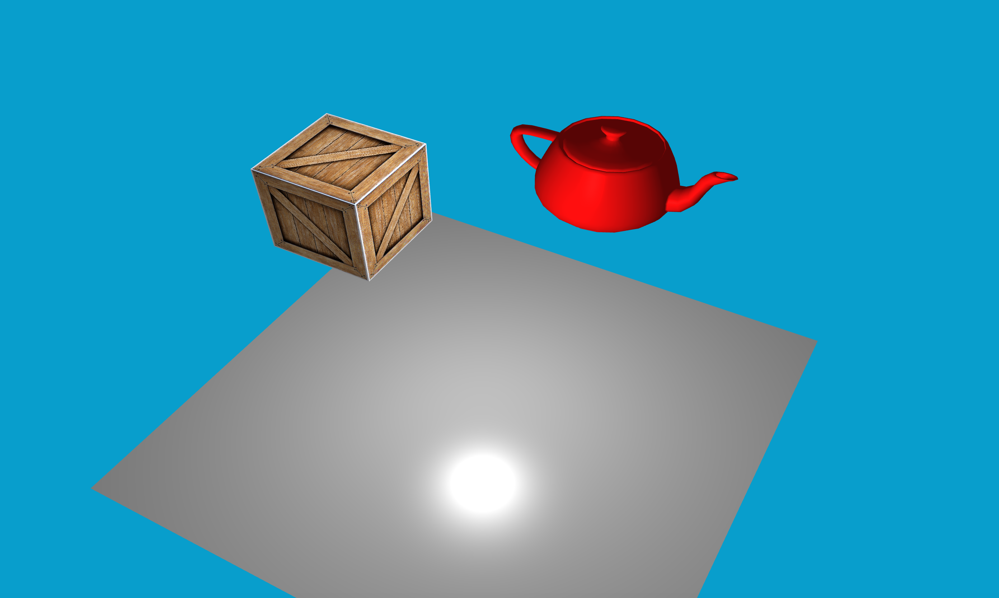

# Custom 3D Engine

A small custom 3D engine written in C++ using OpenGL.  
This project includes basic real-time rendering, textured objects, 3D model loading, shaders, and scene management.

## Preview




## Build

```bash
git clone https://github.com/Goblinking13/Engine.git
cd Engine
mkdir build
cd build
cmake ..
make
./Engine